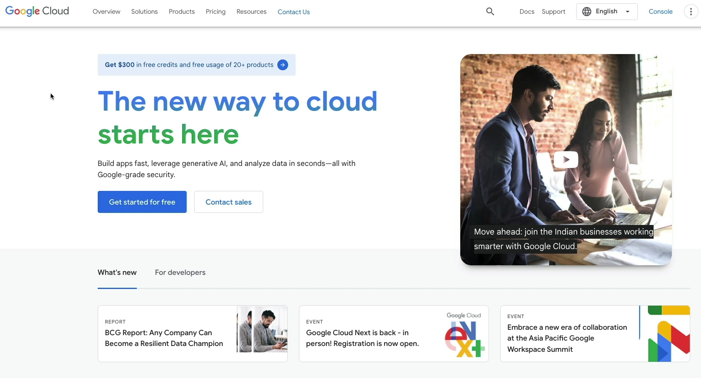
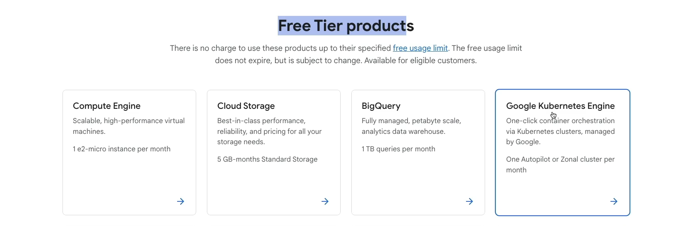
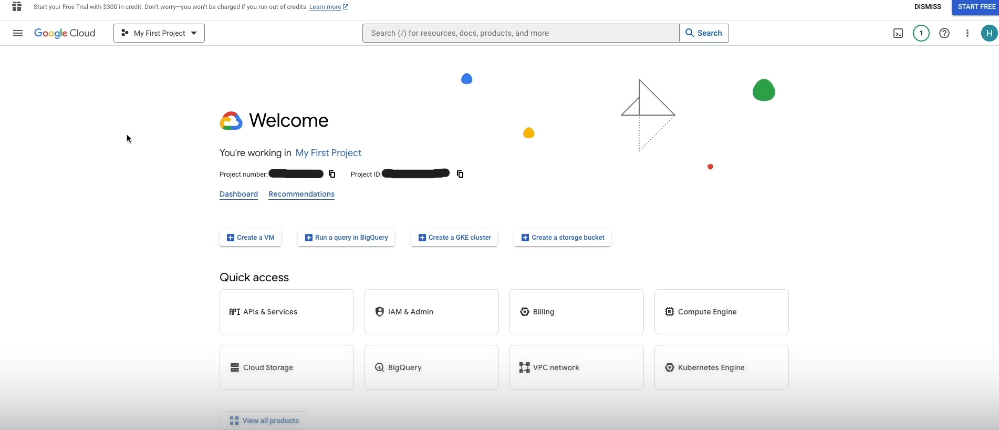
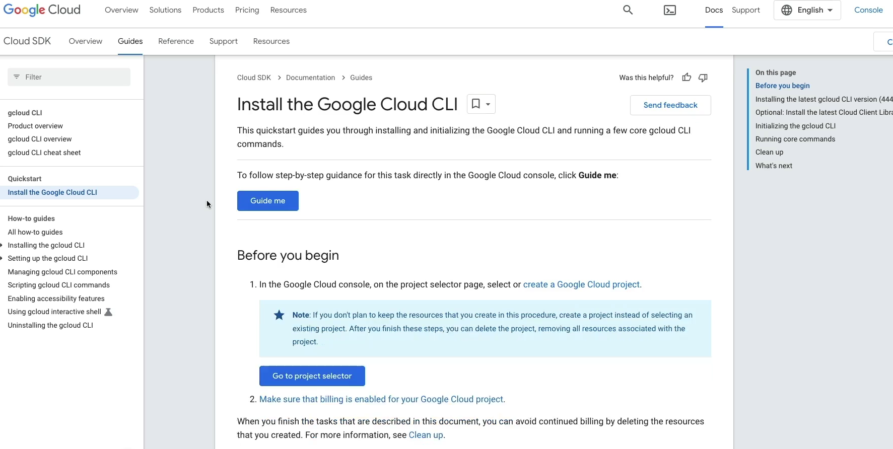
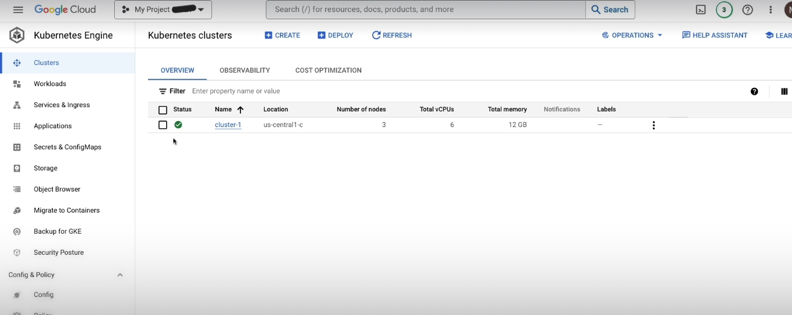
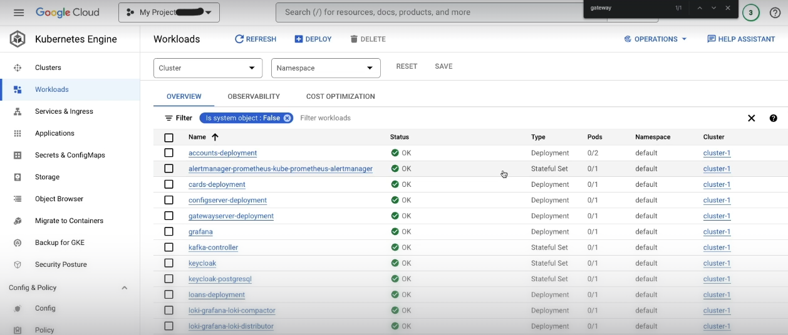
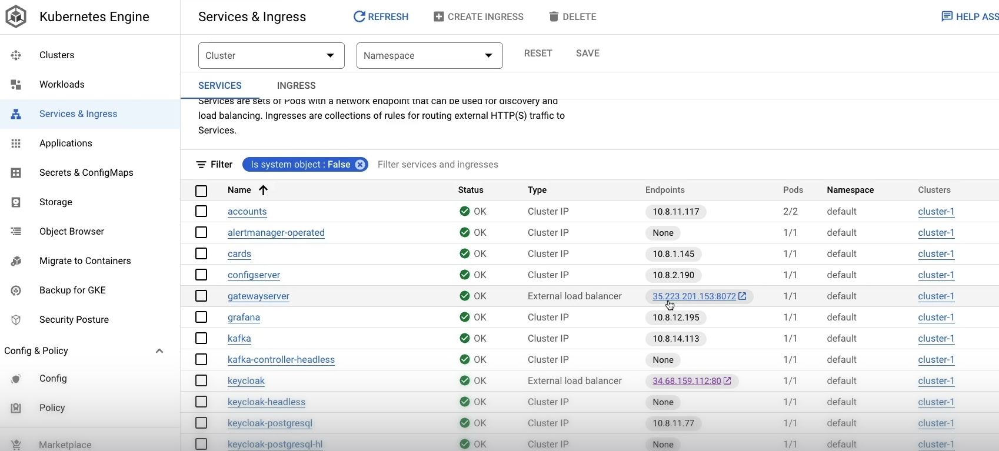
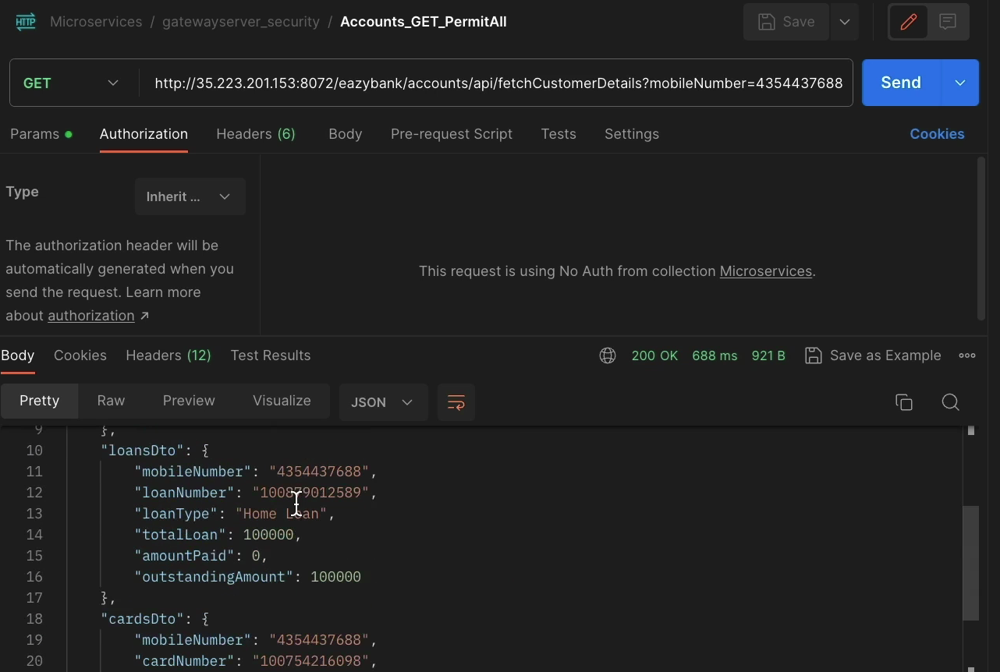

## ☁️ EazyBank Microservices deployment on Google Cloud Platform (GCP) using Google Kubernetes Engine (GKE)


In this section, I deployed my **EazyBank microservices project** to a cloud provider.  
I chose **Google Cloud Platform (GCP)** because it provides a **$300 free tier credit** that can be used within **90 days**, which is sufficient to explore and deploy real-world cloud-native applications.

For container orchestration on the cloud, I used **Google Kubernetes Engine (GKE)**.

---
## ☁️ Benefits of Deploying Microservices on Cloud (GCP)

- 🚀 **High Availability** – Cloud providers ensure services remain available with built-in redundancy and fault tolerance.
- 📈 **Auto Scaling** – Automatically scale microservices up or down based on traffic and load.
- 💰 **Cost Efficiency** – Pay only for the resources you use; free tier credits enable real-world experimentation without cost.
- ☸️ **Managed Kubernetes (GKE)** – No need to manage control plane or cluster internals; Google handles upgrades and security.
- 🌍 **Global Accessibility** – Services can be accessed securely from anywhere using public endpoints.
- 🔐 **Enterprise-Grade Security** – Built-in IAM, network policies, and secure authentication mechanisms.
- ⚙️ **DevOps Friendly** – Easy CI/CD integration, monitoring, logging, and infrastructure as code support.

Deploying EazyBank on **Google Cloud Platform (GCP)** demonstrates real-world **cloud-native, production-ready microservices deployment** using Kubernetes.


---

## 🔹 High-Level Deployment Flow 

This section explains the **end-to-end cloud deployment workflow** of the EazyBank microservices project on **Google Kubernetes Engine (GKE)** in a clear and interview-friendly manner.

---

### 🐳 1. Build Docker Images for All Microservices

Each microservice (Accounts, Loans, Cards, Gateway, etc.) is packaged as a **Docker image**.

- A `Dockerfile` is written for every microservice.
- The application JAR is copied into the image.
- The service is exposed on the required port.
- This ensures **environment consistency** across local, test, and cloud environments.

✅ **Outcome:**  
Each microservice becomes a **portable container image** ready for deployment.

---

### 📦 2. Push Docker Images to Docker Hub

After building images locally:

- All Docker images are **tagged** properly.
- Images are pushed to **Docker Hub**, which acts as a public container registry.
- GKE later pulls these images directly from Docker Hub during deployment.

**Why this step is important:**
- GKE nodes cannot access local images.
- Images must be available from a **remote container registry**.

✅ **Outcome:**  
All microservice images are **centrally available** for cloud deployment.

---

### 🧾 3. Set Up Google Cloud Account and Project

To deploy on GCP:

- A **Google Cloud account** is created using the free tier.
- A **new GCP project** is created.
- This project acts as a **logical container** for all cloud resources such as:
  - Kubernetes clusters
  - Networking
  - Services
  - Billing and monitoring

✅ **Outcome:**  
A dedicated cloud project to manage and isolate EazyBank resources.

---

### ☸️ 4. Create a GKE Kubernetes Cluster

Inside the GCP Console:

- **Google Kubernetes Engine (GKE)** is enabled.
- A **Standard Kubernetes Cluster** is created.
- Google manages:
  - Kubernetes control plane
  - Node health
  - Security patches
  - Cluster upgrades

**Why GKE:**
- Fully managed Kubernetes
- Production-grade reliability
- Easy scaling and monitoring

✅ **Outcome:**  
A **cloud-managed Kubernetes cluster** ready to run microservices.

---

### 🛠️ 5. Connect Local System to GKE Using Cloud SDK

To deploy from the local machine:

- **Google Cloud SDK** is installed locally.
- The CLI is initialized using `gcloud init`.
- Authentication with Google account is completed.
- Cluster credentials are fetched using the **Connect** command from the GKE console.

This allows:
- `kubectl` commands to work against the GKE cluster.
- Local machine to control cloud Kubernetes resources.

**Validation:**
```bash
kubectl get nodes
```

✅ **Outcome:**  
Local system successfully connected to the GKE cluster.

---

### 🚀 6. Deploy Kubernetes Manifests to the Cloud Cluster

Once connected:

- Kubernetes manifest files (`Deployment`, `Service`, `ConfigMap`, etc.) are applied.
- Each manifest defines:
  - Number of replicas
  - Docker image to use
  - Ports
  - Service exposure

**Deployment command:**
```bash
kubectl apply -f <manifest-file>.yml
```

Kubernetes automatically:
- Pulls images from Docker Hub
- Creates pods
- Exposes services
- Handles restarts and scaling

✅ **Outcome:**  
All EazyBank microservices are running as **pods inside GKE**.

---

### 🧪 7. Verify Services and Test APIs Using Cloud Endpoints

After deployment:

- External IPs/endpoints are obtained from **Services & Ingress**.
- APIs are tested using **Postman**.
- Requests are sent via the **API Gateway endpoint**.
- Gateway internally routes requests to Accounts, Loans, and Cards services.

Successful tests confirm:
- Cloud networking is configured correctly
- Inter-service communication works
- Server-side discovery and load balancing are functioning

---
## 🚀 Implementation: Deploying EazyBank Microservices on Google Cloud Platform (GCP)

## 🔹 Google Cloud Account & Project Setup

- First, I visited the **Google Cloud website**.
- Navigated to **Google Kubernetes Engine** and opened the **Console**.
- Clicked on **Try for Free**.
- Filled in required account and billing information.
- After successful setup, I was redirected to the **GCP Dashboard**, where the **$300 free credits** were visible.
- I created a **new GCP project**, which acts as a container for all cloud resources like clusters, services, and networking.

---

## 🔹 Installing Google Cloud SDK (CLI Setup)

To communicate with Google Cloud from my local system, I installed the **Google Cloud SDK**.

Steps:
- Went to the **Cloud SDK – Get Started** page.
- Downloaded and installed the SDK on my local system.
- Verified installation using:

```bash
gcloud --version
```

- Initialized the CLI:

```bash
gcloud init
```

- Logged in using my Google account.
- Selected the created GCP project during initialization.

This setup allows my local `kubectl` and `gcloud` commands to interact with GCP resources.

---

## 🔹 Enabling Kubernetes Engine & Creating GKE Cluster

- From the **Google Cloud Dashboard**, I searched for **Kubernetes Engine**.
- Enabled the **Kubernetes Engine API**.
- Clicked **Create Cluster**.
- Switched to **Standard Cluster**.
- Configured basic cluster settings and created the cluster.

Once the cluster was created:
- Clicked on the **three-dot menu** → **Connect**.
- Copied the provided command and pasted it into my local CLI.

This command established a connection between my local system and the GKE cluster.

To validate the connection:

```bash
kubectl get nodes
```

This confirmed that the Kubernetes cluster was reachable and ready.

---

## 🔹 Deploying Microservices to GKE

After connecting to the cluster:
- I updated all Kubernetes manifest files to be cloud-ready.
- Deployed services using:

```bash
kubectl apply -f accounts.yml
```

- Repeated the same for all other Kubernetes manifest files (loans, cards, gateway, configs, etc.).

Once applied:
- All microservices were successfully deployed on **Google Kubernetes Engine**.
- Kubernetes automatically created pods, services, and networking resources.

---

## 🔹 Accessing & Testing Cloud-Deployed Services

- From the **Services & Ingress** section in GKE:
  - Retrieved external endpoints for the deployed services.
- Used these endpoints to access microservices from outside the cluster.
- Tested APIs using **Postman**:
  - Created Accounts, Cards, and Loans.
  - Invoked the `fetchCustomer` API via **Gateway Service**.
  - Received a successful aggregated response from all services.

This confirmed that:
- Services were running correctly on GCP.
- Inter-service communication was working as expected.
- Gateway routing and cloud networking were properly configured.

---
## 📸 Google Cloud Deployment Screenshots

### 🌐 GCP Dashboard (Free Tier Credits)


This screenshot shows the **Google Cloud Console dashboard** after successful account setup.  
It highlights the **$300 free tier credits**, which allow deploying and testing cloud services like **Google Kubernetes Engine (GKE)** for up to **90 days** without any cost.

---

### ☸️ Selecting Google Kubernetes Engine


Here, **Google Kubernetes Engine (GKE)** is selected from the GCP services list.  
GKE is a **fully managed Kubernetes service** provided by Google, which simplifies cluster creation, scaling, and management for microservices applications.

---

### 🧾 Account Setup & Project Creation


This screenshot confirms that the **GCP account setup is completed** and a **new project is created**.  
All Kubernetes resources such as **clusters, services, deployments, and ingress** are managed under this project using the assigned **Project ID**.

---

### 🛠️ Cloud SDK Installation & Local Setup


This screenshot shows the installation of the **Google Cloud SDK** on the local system.  
The Cloud SDK enables communication between the local machine and GCP using CLI commands like:
- `gcloud --version`
- `gcloud init`  
This step is required to deploy Kubernetes resources to GKE from the local environment.

---

### ☸️ Kubernetes Cluster Creation


This screenshot shows the creation of a **standard GKE cluster** from the GCP console.  
The cluster acts as the **runtime environment** where all EazyBank microservices are deployed and managed by Kubernetes.

---

### 🚀 All Microservices Deployed Successfully


This screenshot confirms that **all microservices (Accounts, Loans, Cards, Gateway, etc.)** are successfully deployed on the GKE cluster.  
Each service is running inside its own **Kubernetes pod**, managed automatically by the cluster.

---

### 🌍 Services & Ingress Endpoints


This screenshot shows the **Services and Ingress** section of GKE.  
Here, Kubernetes exposes microservices using **external IPs and endpoints**, enabling public access to APIs through the **API Gateway**.

---

### 🧪 API Testing via Postman Using GCP Endpoint


This screenshot demonstrates **successful API testing using Postman**.  
Requests are sent to the **GCP-provided Gateway endpoint**, which internally routes calls to Accounts, Cards, and Loans services, proving that the **entire microservices system is live and working on GKE**.


---
## 📚 What I Learned from This Repository

- ☸️ Deploying **Spring Boot microservices** on **Google Kubernetes Engine**
- 🔁 Implementing **server-side service discovery & load balancing** with Kubernetes
- 🐳 Building and pushing **Docker images** for cloud deployment
- 🌐 Configuring **Spring Cloud Gateway** for routing, retries, and resilience
- 🔗 Managing **inter-service communication** using Feign clients
- 📈 Understanding **scalability, fault tolerance, and cloud-native design**
- 🚀 Gaining hands-on experience with **production-ready cloud deployment on GCP**


